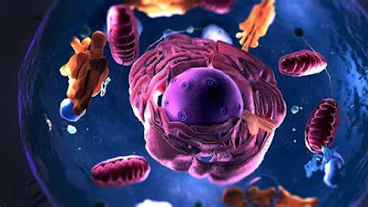
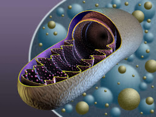
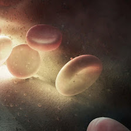

<!DOCTYPE html>
<html lang="en">
<head>
  <meta charset="UTF-8" />
  <meta name="viewport" content="width=device-width, initial-scale=1.0"/>
  <title>CangulusITpark</title>
  <link href="https://cdn.jsdelivr.net/npm/bootstrap@5.3.2/dist/css/bootstrap.min.css" rel="stylesheet">
  <link href="https://fonts.googleapis.com/icon?family=Material+Icons" rel="stylesheet">
  <link rel="stylesheet" href="https://cdnjs.cloudflare.com/ajax/libs/font-awesome/6.5.2/css/all.min.css"/>
  <link rel="icon" type="image/png" href="internet-web-icon-in-flat-style-website-globe-sign-symbol-vector.jpg"/>

  
</head>

<body>

<!-- Navbar -->
<nav class="navbar navbar-expand-lg navbar-light bg-white shadow">
  

    <button style="border:none;border-radius: 5px;"><a class="navbar-brand" href="#">Cangulus</a></button>
    <button class="navbar-toggler" type="button" data-bs-toggle="collapse" data-bs-target="#navbarNav">
      
    </button>
    

      <ul class="navbar-nav">
        <li class="nav-item"><a class="nav-link p-3" href="#">Home</a></li>
        <li class="nav-item"><a class="nav-link p-3" href="#">About</a></li>
        <li class="nav-item"><a class="nav-link p-3" href="#">View</a></li>
        <li class="nav-item"><a class="nav-link p-3" href="https://aarushmitra.blogspot.com/" target="_blank">Blogs</a></li>
        <li class="nav-item"><a class="nav-link p-3" href="#">Contact</a></li>
      </ul>
    

  

</nav>

<!-- Carousel -->

  

    <button type="button" data-bs-target="#myCarousel" data-bs-slide-to="0" class="active"></button>
    <button type="button" data-bs-target="#myCarousel" data-bs-slide-to="1"></button>
    <button type="button" data-bs-target="#myCarousel" data-bs-slide-to="2"></button>
  

  

    

      
      
Blood's liquid component, plasma. It is a pale yellow, slightly sticky fluid that is mostly made up of water, as well as dissolved proteins such albumin, globulins, and fibrinogen, 
        as well as electrolytes, nutrients, hormones, waste products, and gases. Transporting nutrients like glucose and amino acids to tissues, plasma also removes waste materials for excretion, including urea and carbon dioxide. The proteins in plasma have vital functions in clotting, pH buffering, immunity via antibodies, and osmotic pressure, which is essential for preserving fluid balance between blood and tissues. Hormones and enzymes necessary for a number of body processes are also carried by plasma. Plasma aids in the body's thermoregulation by promoting the diffusion of heat, 
        plasma helps to repair wounds and avoid excessive blood loss by maintaining blood's 
        fluid state under normal circumstances and permitting clot formation upon damage. 
        All things considered, plasma is necessary to preserve homeostasis and aid blood cells including erythrocytes, 
        leukocytes, and platelets in their bodily tasks.

    

    

      
      
The most prevalent cellular constituents in human blood, red blood cells, or erythrocytes, 
        are involved in the movement of breathing gasses throughout the body. 
        These cells can readily flex to fit into the microcirculation's small capillaries because of their biconcave shape, which boosts their surface area to volume ratio and promotes effective gas exchange.
         Erythropoiesis, the process by which red bone marrow produces red blood cells, is mostly controlled by the hormone erythropoietin, which is released by the kidneys in reaction to hypoxia, or low blood oxygen levels. 
         The iron containing protein hemoglobin, which binds and transports oxygen from the lungs to tissues and makes it easier to carry carbon dioxide back to the lungs for exhalation, has greater internal space since each adult red blood cell is anucleate and lacks the majority of organelles. A single red blood cell may transport up to a billion oxygen molecules because hemoglobin has a quaternary structure, which is made up of four polypeptide chains. 
        Each heme group in hemoglobin can bind one oxygen molecule.

    

    

      
      
A mutation in the gene that codes for hemoglobin's beta-globin chain causes hemoglobin C disease, 
        a hereditary blood condition. In particular, it results in hemoglobin C, an aberrant form of 
        the beta globin chain, where lysine is substituted for glutamic acid at position six. 
        Red blood cells develop crystalline forms as a result of this alteration in the hemoglobin molecule's electrical charge. The cells' lifetime is shortened and mild to moderate hemolytic anemia may result from these crystals' increased rigidity and decreased flexibility. Hemoglobin C disease patients inherit one HbC gene from each parent. While their symptoms are usually less than those of other hemoglobinopathies, such as sickle cell disease, they may still have splenomegaly, lethargy, and jaundice. In certain instances, elevated red cell turnover may also result in gallstones or joint discomfort. Since most people lead relatively normal lives without requiring frequent treatment, management focuses on supportive care and monitoring. 
        The diagnosis is often verified by hemoglobin electrophoresis or high performance liquid chromatography.

    

  

  <button class="carousel-control-prev" type="button" data-bs-target="#myCarousel" data-bs-slide="prev">
    
  </button>
  <button class="carousel-control-next" type="button" data-bs-target="#myCarousel" data-bs-slide="next">
    
  </button>

<!-- Three Card Section -->

  

    

      

        <h5 class="mt-3">Heading 1</h5>
        <video width="250" height="200" controls class="mx-auto mt-3" alt="Image 1">
        <source src="https://www.youtube.com/watch?v=URUJD5NEXC8&t=230s" type="video/mp4"></video>
        

          
Lorem ipsum dolor sit amet consectetur adipisicing elit. Quisquam, quidem.

          <a href="#"><i class="material-icons">forward</i></a>
        

      

    

    

      

        <h5 class="mt-3">Heading 2</h5>
        <video width="250" height="200" controls class="mx-auto mt-3" alt="Image 1">
        <source src="https://www.youtube.com/watch?v=URUJD5NEXC8&t=230s" type="video/mp4"></video>
        

          
Lorem ipsum dolor sit amet consectetur adipisicing elit. Quisquam, quidem.

          <a href="#"><i class="material-icons">forward</i></a>
        

      

    

    

      

        <h5 class="mt-3">Heading 3</h5>
        <video width="250" height="200" controls class="mx-auto mt-3" alt="Image 1">
        <source src="https://www.youtube.com/watch?v=URUJD5NEXC8&t=230s" type="video/mp4"></video>
        

          
Lorem ipsum dolor sit amet consectetur adipisicing elit. Quisquam, quidem.

          <a href="#"><i class="material-icons">forward</i></a>
        

      

    

  

  

    

      

        <h5 class="mt-3">Heading 1</h5>
        <video width="250" height="200" controls class="mx-auto mt-3" alt="Image 1">
        <source src="https://www.youtube.com/watch?v=URUJD5NEXC8&t=230s" type="video/mp4"></video>
        

          
Lorem ipsum dolor sit amet consectetur adipisicing elit. Quisquam, quidem.

          <a href="#"><i class="material-icons">forward</i></a>
        

      

    

    

      

        <h5 class="mt-3">Heading 2</h5>
        <video width="250" height="200" controls class="mx-auto mt-3" alt="Image 1">
        <source src="https://www.youtube.com/watch?v=URUJD5NEXC8&t=230s" type="video/mp4"></video>
        

          
Lorem ipsum dolor sit amet consectetur adipisicing elit. Quisquam, quidem.

          <a href="#"><i class="material-icons">forward</i></a>
        

      

    

    

      

        <h5 class="mt-3">Heading 3</h5>
        <video width="250" height="200" controls class="mx-auto mt-3" alt="Image 1">
        <source src="https://www.youtube.com/watch?v=URUJD5NEXC8&t=230s" type="video/mp4"></video>
        

          
Lorem ipsum dolor sit amet consectetur adipisicing elit. Quisquam, quidem.

          <a href="#"><i class="material-icons">forward</i></a>
        

      

    

  

  

    

      

        <h5 class="mt-3">Heading 1</h5>
        <video width="250" height="200" controls class="mx-auto mt-3" alt="Image 1">
        <source src="https://www.youtube.com/watch?v=URUJD5NEXC8&t=230s" type="video/mp4"></video>
        

          
Lorem ipsum dolor sit amet consectetur adipisicing elit. Quisquam, quidem.

          <a href="#"><i class="material-icons">forward</i></a>
        

      

    

    

      

        <h5 class="mt-3">Heading 2</h5>
        <video width="250" height="200" controls class="mx-auto mt-3" alt="Image 1">
        <source src="https://www.youtube.com/watch?v=URUJD5NEXC8&t=230s" type="video/mp4"></video>
        

          
Lorem ipsum dolor sit amet consectetur adipisicing elit. Quisquam, quidem.

          <a href="#"><i class="material-icons">forward</i></a>
        

      

    

    

      

        <h5 class="mt-3">Heading 3</h5>
        <video width="250" height="200" controls class="mx-auto mt-3" alt="Image 1">
        <source src="https://www.youtube.com/watch?v=URUJD5NEXC8&t=230s" type="video/mp4"></video>
        

          
Lorem ipsum dolor sit amet consectetur adipisicing elit. Quisquam, quidem.

          <a href="#"><i class="material-icons">forward</i></a>
        

      

    

  

<!-- Footer Card -->

  

    

      <h5 class="card-title">Title</h5>
      
Content

      

        <button class="border-0 shadow-lg p-1"><i class="material-icons">mail</i></button>
        <button class="border-0 shadow-lg p-1" onclick="showOverlay()"><i class="material-icons">person</i></button>
        <button class="border-0 shadow-lg p-1"><i class="material-icons">flight</i></button>
        <button class="border-0 shadow-lg p-1"><i class="material-icons">apps</i></button>
        <button class="border-0 shadow-lg p-1"><i class="material-icons">arrow_forward</i></button>
        <button class="border-0 shadow-lg p-1"><i class="material-icons">build</i></button>
      

    

  

<!-- Overlay Login -->

  

    <h4 class="text-center mb-3">Log in</h4>
    <form>
      

        <label for="email" class="form-label">Email</label>
        <input type="email" class="form-control" id="email">
      

      

        <label for="password" class="form-label">Enter your password</label>
        <input type="password" class="form-control" id="password">
      

      

        <a href="#">Forgot your password?</a>
      

      <button type="submit" class="btn btn-success w-100">Log in</button>
      
Don't have an account? <a href="#">Sign up</a>

      <button type="button" class="btn btn-outline-danger w-100 mt-2" onclick="hideOverlay()">Close</button>
    </form>
  

<!-- Bootstrap JS -->

</body>
</html>
